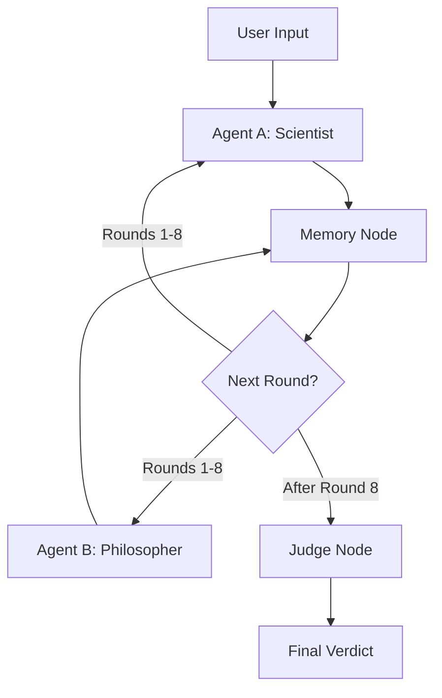

# DebateFlow 🎭⚡

A sophisticated **LangGraph-powered multi-agent debate system** where AI personas engage in structured, intelligent debates. Watch a Scientist and Philosopher battle it out over complex topics with full logging, memory, and automated judging.

  

## 🌟 Features

### 🎯 Core Capabilities
- **Dual-Agent Architecture**: Scientist (evidence-based) vs Philosopher (ethics-focused)
- **Structured 8-Round Debates**: Alternating turns with persistent memory
- **Comprehensive Logging**: Full timestamped audit trail of all events
- **Intelligent Judging**: Automated evaluation with detailed reasoning
- **Smart Memory**: Incremental summarization after each round

### 🔧 Technical Excellence
- **Multi-Provider API Support**: Groq, Google Gemini, OpenAI, Hugging Face
- **Automatic Fallback**: Seamless provider switching on failures
- **Validation System**: Turn checks, repetition detection, coherence monitoring
- **Performance Optimized**: Rate limiting, exponential backoff, connection pooling

## 🚀 Quick Start

### Prerequisites
- Python 3.8+
- API keys for at least one provider (Groq recommended - free tier available)

### Installation

```bash
# Clone the repository
git clone https://github.com/yourusername/DebateFlow.git
cd DebateFlow

# Create virtual environment
python -m venv venv
source venv/bin/activate  # On Windows: venv\Scripts\activate

# Install dependencies
pip install -r requirements.txt

# Set up environment variables
cp .env.example .env
# Edit .env with your API keys
```

### Run Your First Debate

```bash
python main.py
```
When prompted, enter your debate topic or use the sample topic for testing.

## 🏗️ System Architecture



### 🔄 Workflow Details
1. **User Input**: Topic selection and system initialization
2. **Round 1-8**: Alternating arguments between Scientist and Philosopher
3. **Memory Updates**: After each round, system summarizes debate progress
4. **Validation**: Turn order, repetition, and coherence checks
5. **Judgment**: Comprehensive evaluation and winner declaration

## 📁 Project Structure

```
DebateFlow/
├── 📂 nodes/                 # LangGraph Node Implementations
│   ├── agent_a_node.py      # Scientist Agent
│   ├── agent_b_node.py      # Philosopher Agent  
│   ├── memory_node.py       # Debate Summarization
│   ├── judge_node.py        # Final Evaluation
│   ├── user_input_node.py   # Topic Input
│   └── llm_utils.py         # Multi-Provider LLM Management
├── 📂 logs/                 # Debate Transcripts & Analytics
│   └── debate_log.txt       # Complete Debate Records
├── 📄 main.py               # Application Entry Point
├── 📄 state.py              # Debate State Management
├── 📄 utils.py              # Utilities & Enhanced Logging
├── 📄 requirements.txt      # Dependencies
├── 📄 TEST_RUN.md           # Reproduction Guide
└── 📄 .gitignore           # Version Control Configuration
```

## 🎭 Agent Personas

### 🔬 The Scientist
- **Focus**: Empirical evidence, data-driven arguments, risk assessment
- **Style**: Logical, precise, evidence-based reasoning
- **Topics**: Technology impact, scientific progress, public safety

### 🧠 The Philosopher  
- **Focus**: Ethics, human values, societal implications, moral principles
- **Style**: Principled, nuanced, value-oriented reasoning
- **Topics**: Ethical dilemmas, human autonomy, long-term consequences

## 📊 Sample Output

### Debate Log Example
```
=== DEBATE RUN START ===
[2024-01-15 14:30:22] RUN_START
[2024-01-15 14:30:22] Topic: Should AI development be regulated like nuclear technology?
[2024-01-15 14:30:22] Starting debate between Scientist and Philosopher...

[2024-01-15 14:30:25] [UserInput] Topic received: Should AI development be regulated...
[2024-01-15 14:30:27] [AgentA] Generating argument for round 1
[2024-01-15 14:30:28] [Validation-TurnCheck] PASS: Agent A validated for round 1
[2024-01-15 14:30:30] [Round 1] Scientist: AI systems with potential for catastrophic...
[2024-01-15 14:30:31] [Memory] Updated Summary: The debate begins with the Scientist arguing...
```

### Final Judgment
```
[2024-01-15 14:35:18] [Judge] Final Summary: The debate centered on AI regulation...
[2024-01-15 14:35:18] [Judge] Winner: Scientist
[2024-01-15 14:35:18] [Judge] Reason: The Scientist presented more concrete evidence...
```

## 🔧 Configuration

### API Providers (Priority Order)
1. **Groq** (Recommended - Free & Fast)
2. **Google Gemini** (Reliable Backup)
3. **OpenAI** (Fallback Option)
4. **Hugging Face** (Free Tier Available)

### Environment Setup
```env
# Groq (Free - https://console.groq.com)
GROQ_API_KEY=gsk_xxxxxxxxxxxxxxxxxxxxxxxxxxxxxxxx

# Google Gemini (https://aistudio.google.com/)
GOOGLE_API_KEY_1=AIzaSyxxxxxxxxxxxxxxxxxxxxxxxxxxxxxxx

# OpenAI (Optional)
OPENAI_API_KEY=sk-proj-xxxxxxxxxxxxxxxxxxxxxxxxxxxxxxxx

# Hugging Face (Free - https://huggingface.co/)
HUGGINGFACEHUB_API_TOKEN=hf_xxxxxxxxxxxxxxxxxxxxxxxxxxxxxxxx
```

## 🧪 Testing & Validation

### Run Complete Test Suite
```bash
# Comprehensive system test
python test_all_providers.py

# Quick functionality check
python quick_test.py

# Reproduce sample debate (see TEST_RUN.md)
python main.py
```

### Validation Checks
-  **Turn Validation**: Ensures proper speaking order
-  **Repetition Detection**: Identifies redundant arguments  
-  **Coherence Monitoring**: Maintains debate quality
-  **API Health**: Continuous provider status checks

## 🛠️ Technical Details

### Built With
- **LangGraph** - Workflow orchestration and state management
- **LangChain** - LLM integration and prompt management
- **Pydantic** - Type-safe state validation
- **Multiple LLM Providers** - Groq, Google Gemini, OpenAI, Hugging Face

### Performance Features
- **Rate Limiting**: Prevents API quota exhaustion
- **Exponential Backoff**: Intelligent retry mechanisms
- **Connection Pooling**: Optimized API usage
- **Memory Efficiency**: Streamlined state management

## 📈 Logging & Analytics

The system generates comprehensive logs including:
- **Temporal Data**: Precise timestamps for all events
- **Node Activities**: Complete workflow tracing
- **Round Transcripts**: Full argument history
- **Memory Evolution**: Progressive summarization
- **Validation Results**: Quality assurance metrics
- **Judgment Rationale**: Detailed winner justification

## 🎯 Use Cases

### 🎓 Academic Applications
- Critical thinking exercises
- Argumentation structure analysis
- AI ethics education
- Debate technique study

### 🔬 Research Applications
- Multi-agent interaction studies
- LLM reasoning capability analysis
- Automated debate quality assessment
- AI safety research

### 💼 Practical Applications
- Policy debate simulation
- Product decision analysis
- Strategic planning discussions
- Team decision-making exercises

## 🤝 Contributing

We welcome contributions! Please see our [Contributing Guidelines](CONTRIBUTING.md) for details.

### Development Setup
```bash
# Fork and clone the repository
git clone https://github.com/yourusername/DebateFlow.git

# Set up development environment
pip install -r requirements-dev.txt

# Run tests
pytest tests/

# Submit pull request
```

## 📄 License

This project is licensed under the MIT License - see the [LICENSE](LICENSE) file for details.

## 🙏 Acknowledgments

- **LangGraph Team** - For the excellent workflow framework
- **Groq** - For providing fast, free API access
- **Google AI** - For Gemini model access
- **OpenAI** - For GPT model capabilities
- **Hugging Face** - For open model hosting

---

<div align="center">

**DebateFlow** - Where AI minds meet and ideas collide 💥

*Building the future of intelligent discourse, one debate at a time*

[Report Bug](https://github.com/yourusername/DebateFlow/issues) · [Request Feature](https://github.com/yourusername/DebateFlow/issues)

</div>
